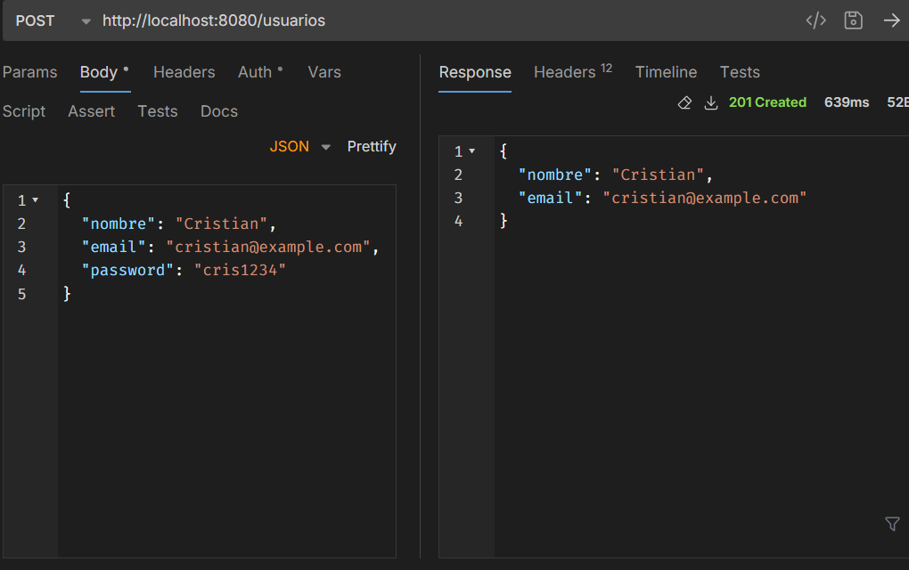
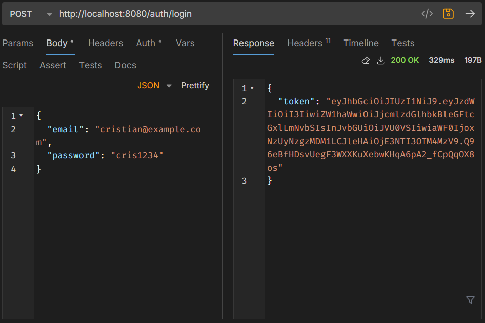
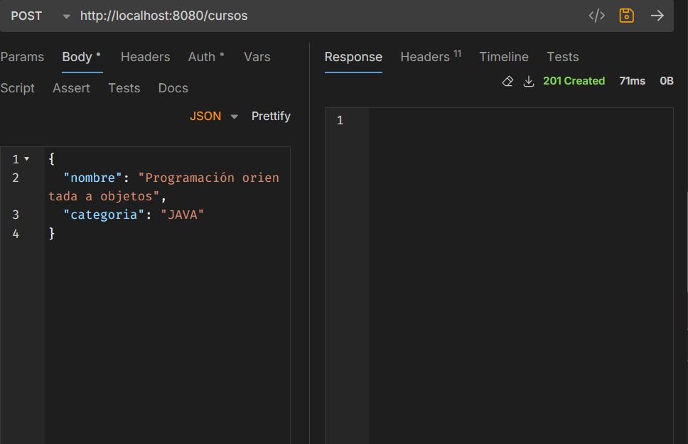
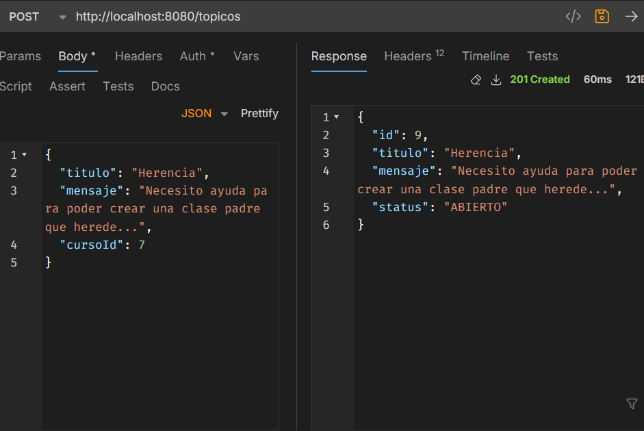
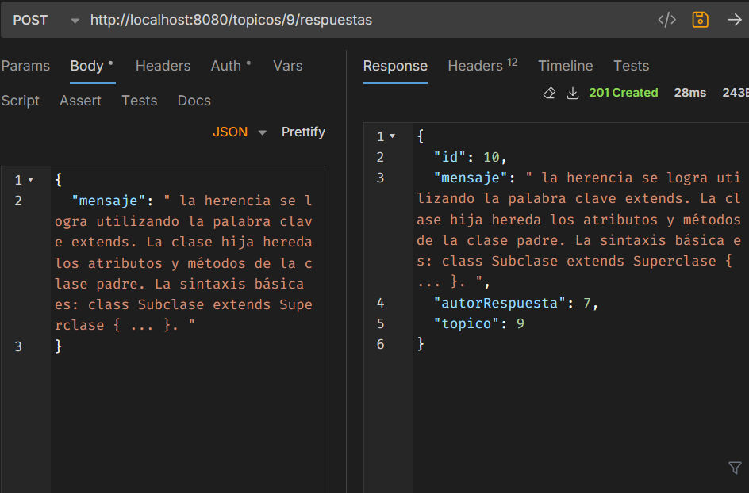

# <h1 align="center">FORO HUB API</h1>

<p>API Restful con <a href="https://spring.io/projects/spring-boot" target="_blank">Spring Boot</a> </p>

## Descripción

La API de Foro hub es un proyecto de backend que permite interactuar con otros usuarios en un foro a través de 
la creación de tópicos y respuestas para resolver problemas relacionados con los cursos en los que 
están inscritos. 

## Características

1. Registro e inicio de sesión usando jwt
2. Crear tópicos relacionados con algún curso
3. Crear respuestas a los tópicos creados
4. Listar tópicos y respuestas paginadas
5. Editar y eliminar tópicos y respuestas
6. Listar cursos
7. Marcar solución de un tópico según la respuesta
8. Crear, actualizar y eliminar curso (rol admin)

## Tecnologías principales

1. Java
2. Springboot
3. MySQL
4. JWT

## Cómo utilizar

1. Clonar el repositorio

   ```bash
    $ git clone https://github.com/Cr1sti4n85/foro-hub.git
   ```

2. Crear la base de datos en MySQL. 

3. Configura el archivo **application.yaml** con las variables correspondientes
   (por defecto, la variable "secret" parael jwt requiere un mínimo de 32 caracteres)

4. Ejecuta la aplicación por medio del archivo **ApiApplication**. Los archivos de
   migraciones crearán las tablas y las relaciones correspondientes.

5. Para ver los endpoints y operaciones disponibles en la API, puedes acceder a su documentación
   (<url-de-tu-api>/swagger-ui.html)

## Capturas









